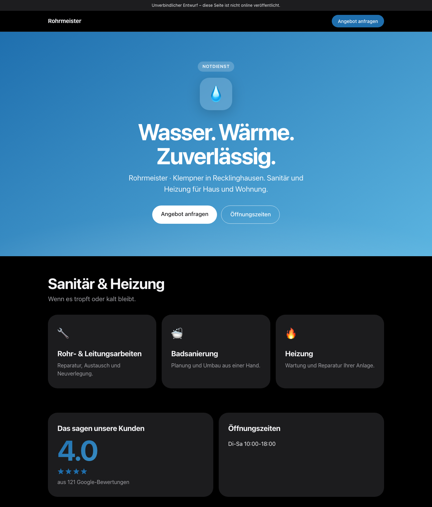
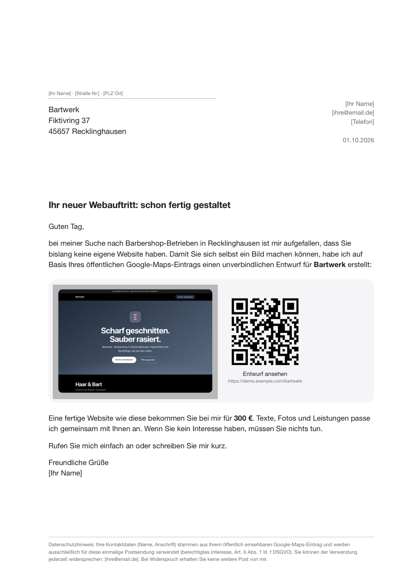
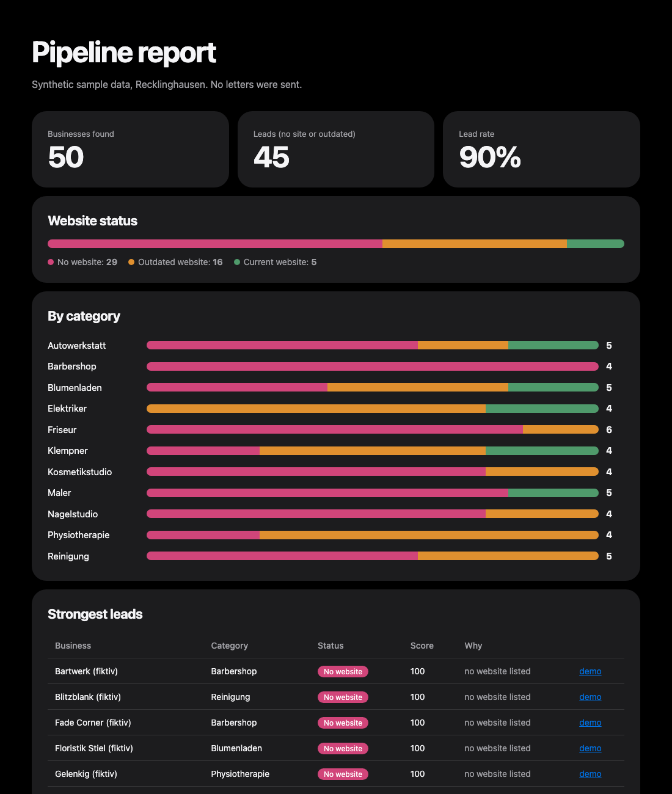
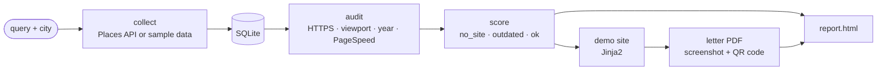

# business-site-finder

[](https://github.com/nikita-automation/business-site-finder/actions/workflows/ci.yml)

Pipeline that finds local businesses on Google Maps with **no website or an outdated one**, builds a personalised demo site for each, and prepares a print-ready letter with a QR code. Nothing is ever sent: the output is a folder of PDFs and demo pages.

> Portfolio project. The repository contains only synthetic sample data. Real business data is never committed.

## What it produces

| Demo site (per business) | Print-ready letter | Pipeline report |
|---|---|---|
|  |  |  |

## Pipeline



| Stage | Status | What it does |
|---|---|---|
| collect | done | Fetch businesses into SQLite from a pluggable source (official Google Places API or synthetic sample data) |
| audit | done | Check HTTPS, mobile viewport, copyright year, site generator, PageSpeed |
| score | done | Classify each business: `no_site`, `outdated`, `ok` |
| demo | done | Render a static demo site from a Jinja2 template and Maps data |
| letter | done | A4 PDF with demo screenshot and a QR code to the demo page |
| report | done | Summary of what was found and generated |

## Why letters and not e-mail

The target audience is German small businesses, and the channel choice follows from German law and from the data itself.

1. **Cold e-mail is restricted.** Under §7 UWG, unsolicited electronic advertising needs prior consent, and this applies to businesses too. Mass cold e-mail invites cease-and-desist letters and fines. Addressed postal advertising is not covered by that rule.
2. **The data does not support e-mail anyway.** A business with no website usually has no public e-mail address. Google Maps gives a phone number and a postal address, so post is the one channel that reaches exactly the target group.
3. **Paper converts better for this audience.** A printed mock-up of the owner's own site, with a QR code to a live demo, is tangible in a way an inbox message is not.
4. **Opt-out is simple.** Each letter names the sender, states where the data came from (public Maps listing), and explains how to object under the GDPR. Anyone who objects goes on a suppression list.

## Quick start

```bash
cd business-site-finder
python3 -m venv .venv && .venv/bin/pip install -r requirements.txt
export PYTHONPATH=src
.venv/bin/python -m bsf collect --source sample   # 50 synthetic businesses
.venv/bin/python -m bsf analyze                   # audit sites + score
.venv/bin/python -m bsf leads --top 10            # strongest leads with reasons
.venv/bin/python -m bsf demo --top 10             # demo sites in output/demos/
.venv/bin/python -m bsf letter --top 10           # print-ready PDFs in output/letters/ (needs Google Chrome)
.venv/bin/python -m bsf report                   # output/report.html summary
.venv/bin/python -m unittest discover -s tests
```

To use real data, copy `.env.example` to `.env`, add your own `GOOGLE_PLACES_API_KEY` (Places API (New), with a budget cap set in Google Cloud), then:

```bash
PYTHONPATH=src .venv/bin/python -m bsf collect --source places --city Recklinghausen
```

By default it runs a list of categories where small businesses often have no website (hairdressers, workshops, trades, florists...). Use `--query` (repeatable) to pick your own. Places API returns at most 60 results per query, so coverage comes from many categories rather than one broad search.

Data sources implement one small interface (`PlaceSource.search`), so other providers can be added as a single new file. The official API was chosen over scraping services to stay within Google's terms.

## Letters

Copy `sender.example.json` to `sender.json` and fill in your details (price, contact data, base URL of the demo pages). `sender.json` is git-ignored. Each letter is a one-page A4 PDF with a DIN-style address block, a screenshot of the personalised demo, a QR code, and a GDPR notice with an opt-out contact.

## Privacy

- No real business data in the repo (`data/places.db` and `output/` are git-ignored).
- Business details of sole proprietors can be personal data: keep lists local, minimal, and delete them after use.
